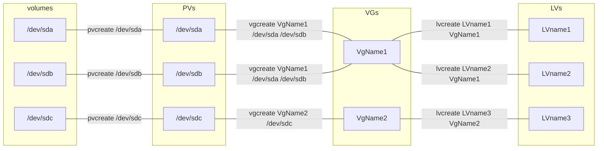

Sous linux les périphériques de stockage sont dans /dev/sd.., eg :

    /dev/sda  
    /dev/sdb  
        ...  

Ce sont des volumes, tels quels il n'est pas possible de les "utiliser" (monter un FS directement sur un volume. A vérifier.)

Exemple de partitionnement des volumes sous linux :  

sda  
├─sda1  
├─sda14  
└─sda15  
sdb  
└─sdb1  

Quelques commandes LVM :  
[doc redhat lvm](https://web.mit.edu/rhel-doc/5/RHEL-5-manual/Deployment_Guide-en-US/s1-disk-storage-lvm.html)  

Exemple : lvmdiskscan, sur ma VM on retrouve les partitions et volumes listés plus haut, dont 1 disque utilisable par LVM :  

```console
root@VMAdminB2G3:/# lvmdiskscan
  /dev/loop0 [     <61.93 MiB]
  /dev/loop1 [      67.81 MiB]
  /dev/sda1  [      29.89 GiB]
  /dev/loop2 [      46.96 MiB]
  /dev/loop3 [      46.95 MiB]
  /dev/sda14 [       4.00 MiB]
  /dev/sda15 [     106.00 MiB]
  /dev/sdb1  [      <7.00 GiB]
  /dev/sdc   [      32.00 GiB]
  1 disk
  8 partitions
  0 LVM physical volume whole disks
  0 LVM physical volumes
```  

Les "disques", ou volumes /dev/sda, sb, etc. doivent être convertis en "pv" (physical volumes) avant d'être utilisés en lvm.  

ces "pvs" peuvent être répartis en différents "groupes" appelés VGs (Volume Groups)  

enfin viennent les "logical volumes", ou "LVs", formattés en Ext. Un LV peut être renommé pour avoir un nom compréhensible, fonction de son utilisation  

Tous ces éléments sont gérés par le système de "FS"  

Pour vérifier si il y a déjà du LVM, il faut voir le fichier /etc/fstab  

Exemple schématique :  
Où les volumes sda, sdb et sdc ont été convertis en PVs (commande pvcreate), le premier PV contient un premier VG, qui lui même contient 2 LVs

Les PVs sdb et sdc contiennent un second VG, qui contient un LV :

